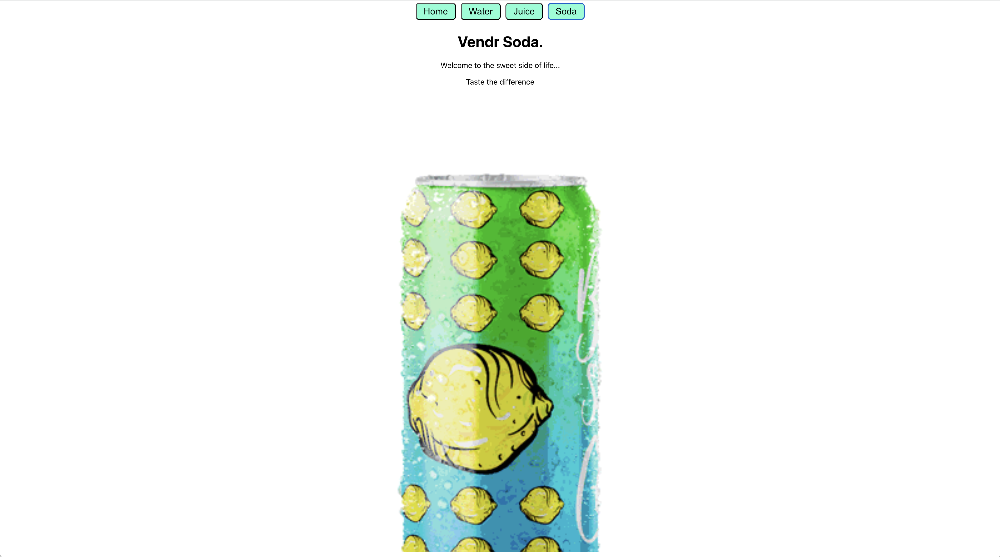

**Vendr - React Vending Machine**

## Description

Vendr is a simple React vending machine application that allows users to choose between different refreshing drinks. This project utilizes React Router for navigation between different drink options.

## Features

- Choose between Water, Juice, and Soda.
- Smooth animations to enhance user experience.

## Installation

1. Clone the repository.
2. Navigate to the project directory.
3. Install dependencies using `npm install`.
4. Start the development server using `npm start`.

## Usage

1. Upon launching the application, users are greeted with a welcome message and a selection of refreshing drinks.
2. Click on the buttons corresponding to the desired drink to navigate to the respective drink page.
3. Enjoy exploring the different drink options!

## Screenshots

## Technologies Used

- React
- React Router
- CSS

## Built

- By Samie Smilz

## License

This project is licensed under the [MIT License](https://opensource.org/licenses/MIT).
